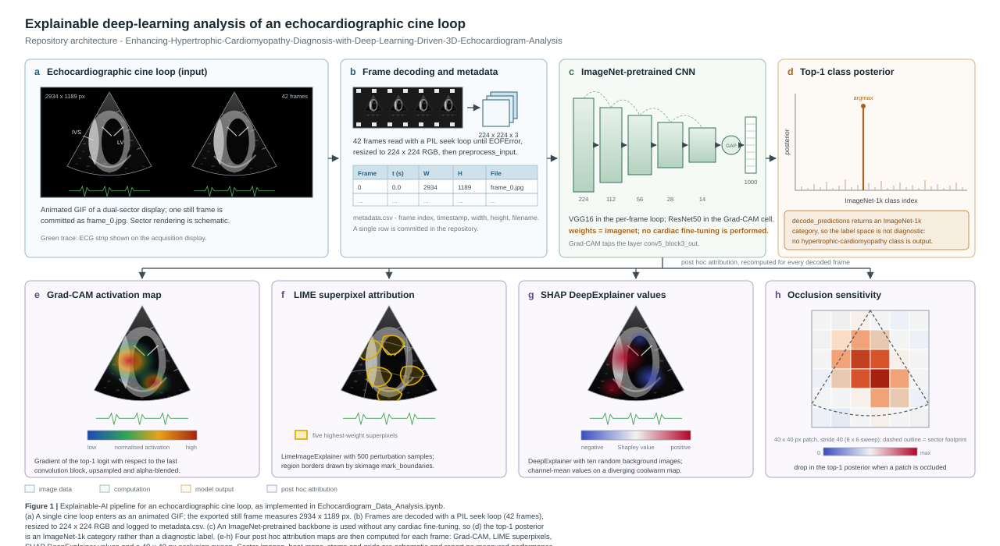

# Enhancing Hypertrophic Cardiomyopathy Diagnosis with Deep-Learning-Driven 3D Echocardiogram Analysis

Explainable-AI probe of an echocardiographic cine loop: frame decoding, an ImageNet-pretrained convolutional backbone, and four post hoc attribution methods (Grad-CAM, LIME, SHAP and occlusion sensitivity).

> **Scope note.** The notebook in this repository is an explainability harness, not a trained diagnostic model. Both backbones are loaded with `weights='imagenet'` and predictions are decoded with `decode_predictions`, so the model output is an ImageNet-1k category rather than a hypertrophic-cardiomyopathy label; no fine-tuning step, labelled split or validation loop appears in the notebook. The repository name states the direction of the work, and the code currently implements the imaging and explainability plumbing for it.

## Architecture



*Figure 1. Panels a-d follow the forward path from the cine loop to the top-1 posterior; panels e-h show the four attribution maps computed for every decoded frame. All rendered images, heat maps and bars in the figure are schematic.*

## Input data

| Artefact | Detail |
| --- | --- |
| `WhatsApp GIF 2025-02-04 at 13.16.22.gif` | Animated echocardiographic loop. Read frame by frame with `PIL.Image.seek`; 42 frames are decoded before `EOFError`. |
| `frame_0.jpg` | The first decoded frame, 2934 x 1189 px. The aspect ratio indicates a capture of the scanner display rather than a volumetric export. |
| `metadata.csv` | Columns `Frame Index, Timestamp (s), Width, Height, Filename`. One row is committed: `0, 0.0, 2934, 1189, frame_0.jpg`. |

## Method

**Frame decoding.** The GIF is opened with Pillow and advanced with `gif.seek(gif.tell() + 1)` inside a `try/except EOFError` block. Each frame is converted to RGB, resized to 224 x 224 and appended to a list, giving 42 frames for the committed loop. A frame index, a timestamp and the native frame dimensions are written to `metadata.csv`.

**Backbone.** Two Keras applications are used. `ResNet50(weights='imagenet')` drives the standalone Grad-CAM cell, which taps the activation tensor of `conv5_block3_out`. `VGG16(weights='imagenet')` drives the per-frame explainability loop. Frames pass through `preprocess_input` before inference, and the predicted class is taken as the `argmax` of the 1000-way softmax.

**Attribution.** Four complementary methods are computed for each frame. Grad-CAM weights the last convolutional feature map by the channel-mean gradient of the winning logit, rectifies and normalises the result, resizes it to the frame, applies `cv2.COLORMAP_JET` and blends it at alpha 0.4. LIME (`lime_image.LimeImageExplainer`) perturbs 500 superpixel masks and returns the five highest-weight regions, outlined with `skimage.segmentation.mark_boundaries`. SHAP (`shap.DeepExplainer`) estimates Shapley values against ten background tensors. Occlusion sensitivity slides a 40 x 40 px zero patch across the 224 x 224 frame at stride 40 and records the drop in the winning posterior.

**Visual output.** For every frame the notebook renders a 2 x 2 matplotlib panel: the original frame annotated with the predicted label, the LIME boundary overlay, the SHAP attribution map on a `hot` colour map, and the occlusion sensitivity map on `coolwarm`.

## Repository contents

| Path | Description |
| --- | --- |
| `Echocardiogram_Data_Analysis.ipynb` | Colab notebook holding the whole pipeline. Does not currently render on GitHub (see limitations). |
| `WhatsApp GIF 2025-02-04 at 13.16.22.gif` | The input cine loop. |
| `frame_0.jpg` | Exported still frame used by the Grad-CAM cell. |
| `metadata.csv` | Frame index table written during decoding. |
| `docs/architecture.svg` | Figure 1, vector source. |

## Running locally

```bash
pip install tensorflow opencv-python matplotlib numpy shap lime scikit-image pillow
jupyter notebook Echocardiogram_Data_Analysis.ipynb
```

The notebook was authored in Google Colab and reads its inputs from `/content/`. Off Colab, either place the GIF and `frame_0.jpg` in a `/content` directory or edit the two path constants at the top of the relevant cells. A GPU is not required; the per-frame LIME and occlusion sweeps dominate the runtime and take roughly a minute per frame on CPU.

## Known limitations

1. **No cardiac model.** Both backbones carry ImageNet weights and predict into the ImageNet-1k label space, so every attribution map explains a natural-image decision rather than a cardiac one. The maps are informative about where the network looks, not about myocardial wall thickness or hypertrophy.
2. **The notebook does not render on GitHub.** The blob view reports that the `state` key is missing from `metadata.widgets`, a known Colab/nbformat defect. Removing the `widgets` block from the notebook metadata restores rendering.
3. **Hard-coded Colab paths.** Input filenames are absolute (`/content/...`) and the GIF name is embedded in the source, so the notebook is not runnable as committed outside Colab.
4. **Incomplete metadata.** Forty-two frames are decoded but only one row is present in `metadata.csv`.
5. **Noise as a SHAP baseline.** The DeepExplainer background is `np.random.randn(10, 224, 224, 3)`, i.e. Gaussian noise rather than a sample of real frames, which makes the resulting Shapley values hard to interpret.
6. **Single study, and not volumetric.** One cine loop is committed. The frame is a capture of a two-dimensional sector display, so no three-dimensional volume is actually read despite the repository title.

## Roadmap

1. Strip the broken `widgets` metadata so the notebook renders on GitHub.
2. Replace absolute paths with a `data/` directory and command-line arguments, and split the notebook into `decode_frames.py`, `explain.py` and a thin driver notebook.
3. Write all decoded frames to `metadata.csv`, including native timestamps read from the GIF delay field.
4. Train or fine-tune on a labelled echocardiography cohort so that the label space becomes diagnostic, and report AUROC with confidence intervals against a held-out split rather than per-frame illustrations.
5. Use a sample of real frames as the SHAP background, and repeat the occlusion sweep at a finer stride with a baseline matched to the image statistics.
6. Crop the sector region out of the display capture before inference, so that on-screen text and calipers cannot drive the attribution maps.

## Related repositories

- [Cardiomyocyte-cell-motion-analysis](https://github.com/datascintist-abusufian/Cardiomyocyte-cell-motion-analysis) - parametric simulator of cardiomyocyte maturation.
- [triFuse-pytorch](https://github.com/datascintist-abusufian/triFuse-pytorch) - scribble-supervised cardiac MRI segmentation.
- [Transformative-Insights-in-Pulmonary-Radiography-AI-Enabled-Innovations](https://github.com/datascintist-abusufian/Transformative-Insights-in-Pulmonary-Radiography-AI-Enabled-Innovations) - multi-label chest radiograph classification with Grad-CAM.

## Licence

No licence has been declared for this repository. The echocardiographic loop is clinical imaging data and is not covered by any licence granted here.

## Author

Md Abu Sufian - ORCID [0009-0007-3503-6942](https://orcid.org/0009-0007-3503-6942)
